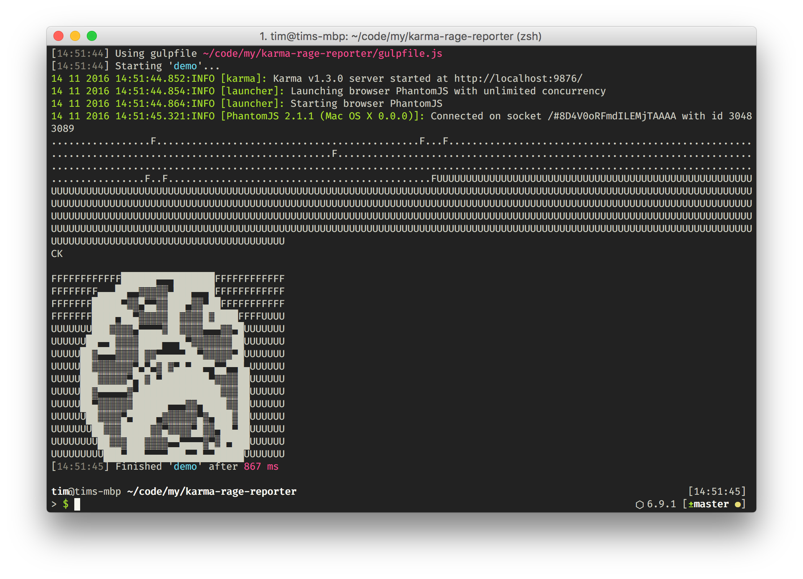

[](https://david-dm.org/somaritane/karma-rage-reporter#info=devDependencies)
[](https://david-dm.org/somaritane/karma-rage-reporter#info=peerDependencies)
[](https://david-dm.org/somaritane/karma-rage-reporter)

# karma-rage-reporter
Karma test reporter plugin inspired by [PEP712]


## Installation

The easiest way is to install `karma-rage-reporter` package as devDependency in your `package.json`.
```json
{
  "devDependencies": {
    "karma": "~0.10",
    "karma-rage-reporter": "~0.1"
  }
}
```

You can simply do it by:
```bash
npm install karma-rage-reporter --save-dev
```

## Configuration

```js
// sample karma.conf.js:
module.exports = function(config) {
    config.set({
        reporters: ['rage'],
        plugins: [
            'karma-rage-reporter'
        ]
    });
};
```

You can pass list of reporters as a CLI argument too:
```bash
karma start --reporters rage
```

----

For more information on Karma see the [homepage].


[homepage]: http://karma-runner.github.com
[PEP712]: http://www.revsys.com/blog/2011/oct/20/pep712-proposal-make-unittest2-more-accurate/
